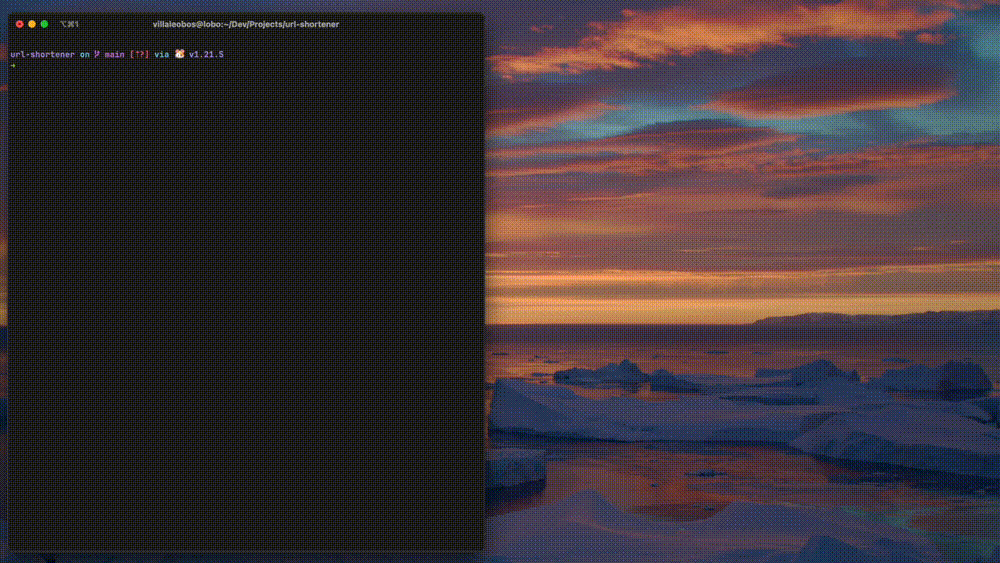

# 🔗 URL Shortener
URL Shortener is a public REST API service that enables users to shorten long URLs.


[Full Demonstration](https://drive.google.com/file/d/1trZCTIr6j5KRPAh_4o9s6IIC3grucxw4/view?usp=sharing)

🔨 URL Shortener is built using the Encore backend development platform. Encore enabled me to build and deploy the service without platform distractions, nor having to repeat boilerplate code.

## 🗒️ Usage
To use URL Shortener, you need to install Go and the Encore development platform. The [go.dev](https://go.dev/doc/install) webpage has an excellent installation guide on how to install Go. 

To install Encore, run the following command then follow any instructions on the CLI.
```bash
brew install encoredev/tap/encore
```

> 🤔 If you don't want to use Homebrew, you can read other installation instructions on the [Encore webpage](https://encore.dev/).

After installing Go and Encore, open a terminal session and change directory to where the project was downloaded. If you downloaded the source code from GitHub, it will probably be in your `Downloads` folder.
```bash
cd Downloads/
```

In the same directory as the project, run the project using Encore.
```bash
encore run
```

A dashboard webpage will open in your browser. Your environment will look just like mine in the demonstration video. 

> 🥰 Now you can call the endpoints and start shortening URLS!
